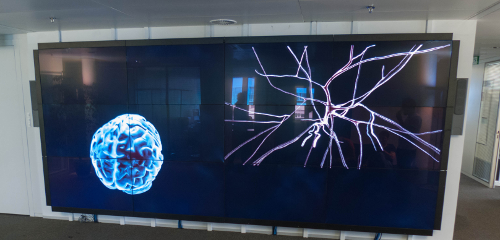

Release Notes {#mainpage}
============

[TOC]

# Introduction {#Introduction}

Welcome to DisplayCluster, a software environment for interactively driving
large-scale tiled displays.

You can find more information in the @ref documentation.

## Features {#Features}

DisplayCluster provides the following functionality:
* Interactively view media such as high-resolution imagery and video
* Stream content from remote sources such as laptops / desktops or
high-performance remote visualization machines

- - -

# New in this release {#New}

DisplayCluster 0.2.0 provides the following features:

## New Features {#NewFeatures}

* @ref documentation

## Enhancements {#Enhancements}

* Updated to the last CMake subtree
* Unit tests can now generate a coverage report
(using lcov, provided by CommonCTest.cmake)

## Optimizations {#Optimizations}

* No optimizations

## Documentation {#Documentation}

* Added the first version of Documentation.md and RelNotes.md

## Bug Fixes {#Fixes}

* Fixed unit tests execution on the cluster

## Known Bugs {#Bugs}

The following bugs were known at release time:

* No known bugs

Please file a [Bug Report](https://bbpteam.epfl.ch/project/issues/browse/DISCL)
if you find any other issue with this release.
- - -

# About {#About}

DisplayCluster uses CMake to create a platform-specific build environment.
The following platforms and build environments are tested:

* Linux: Ubuntu 13.04, 13.10 and RHEL 6 (using a Qt4.8.4 module)
(Makefile, i386, x64)
* Mac OS X: 10.7, 10.8, 10.9 - DesktopStreamer and dcstream library only
(Makefile, XCode, i386, x64)

The [API documentation](http://bluebrain.github.io/DisplayCluster-0.2/index.html)
can be found on [bluebrain.github.io] (http://bluebrain.github.io/)

- - -

# Errata {#Errata}

* Post-release hot fixes go here
